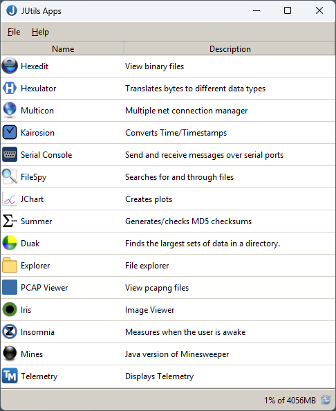
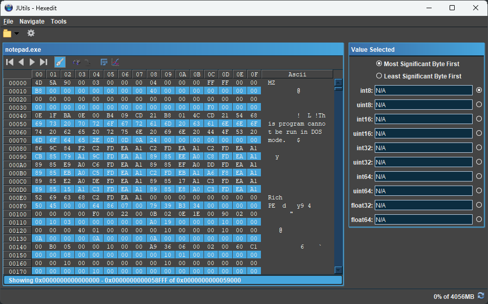
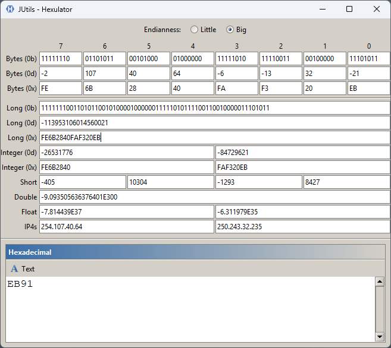
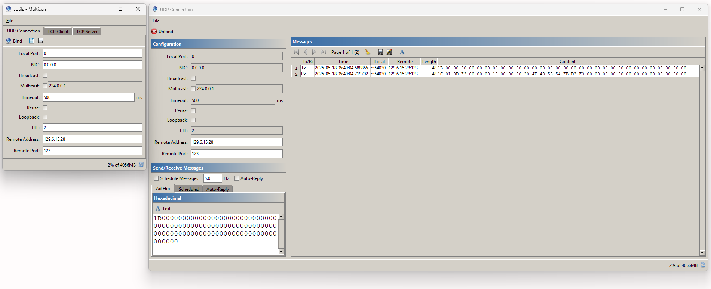

# JUtils

Contains common utility classes for java.

[To Do](./todo.md)

## License

JUtils is licensed under the MIT License. You are permitted to use, copy, modify, distribute, sublicense and sell copies of the software.

JUtils comes with no warranty of correctness though it totally is.

## Main Projects

| Name | Description |
| --- | --- |
| [Apps](./docs/apps.md) | Provides a launcher that bundles all applications, tools, and displays into a single application. |
| [Core](./docs/core.md) | A library of the core JUtils classes. |
| [Demo](./docs/demo.md) | Demonstrates the look and operation of JUtils components. |
| [Duak](./docs/duak.md) | Disk Usage Analyser Kit |
| [Explorer](./docs/explorer.md) | A file explorer. |
| [FileSpy](./docs/filespy.md) | Search for, and within, files. |
| [HexEdit](./docs/hexedit.md) | A hex view who dreams of being an editor. |
| [CUtils](./docs/cutils.md) | A set of C++ classes; some of which, has access through JNI. |
| [Insomnia](./docs/insomnia.md) | Measures when the user is awake.  |
| [Math](./docs/math.md) | Provides a library of math, matrix operations, and coordinate transformations. |
| [Mines](./docs/mines.md) | Java version of minesweeper. |
| [Multicon](./docs/multicon.md) | Multiple network connection manager. |
| [Platform](./docs/platform.md) | Provides an library for platform specific functions including Serial UART. |
| [Plot](./docs/plot.md) | Creates scatter plots. |
| [Summer](./docs/summer.md) | Generates/validates checksums. |
| [Telemetry](./docs/telemetry.md) | Displays telemetry files and parameters. |

## Supporting Projects

| Name | Description |
| --- | --- |
| Libs |  |
| Tests |  |

## Screenshots

- [Main Screen](#main-screen)
- [Hexedit Screen](#hexedit-screen)
- [Hexulator Screen](#hexulator-screen)

### Main Screen

### Hexedit Screen

### Hexulator Screen

### Multicon Screen

