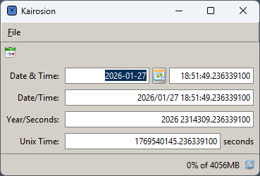
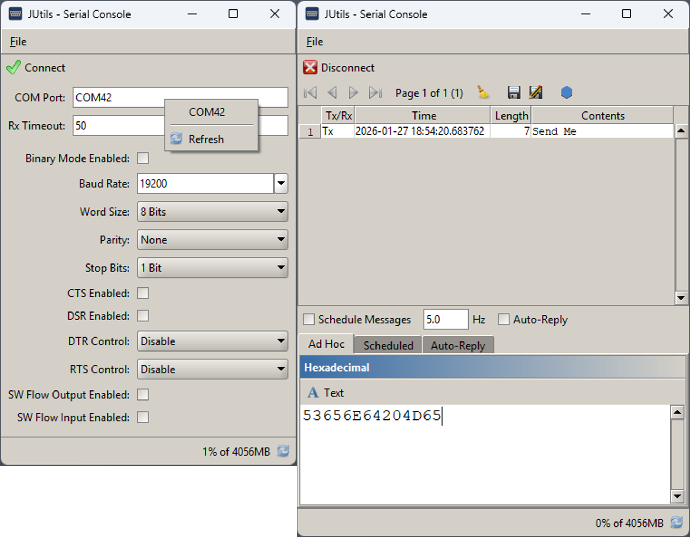
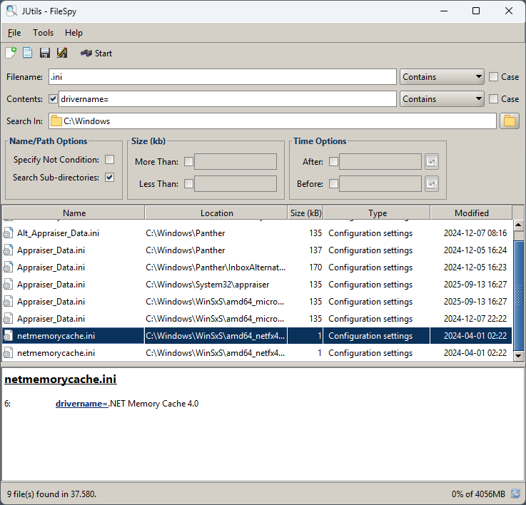
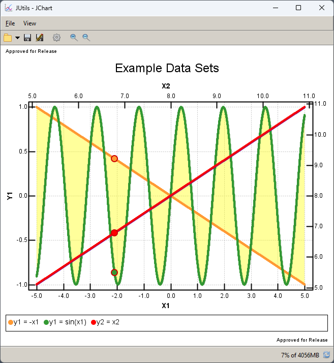
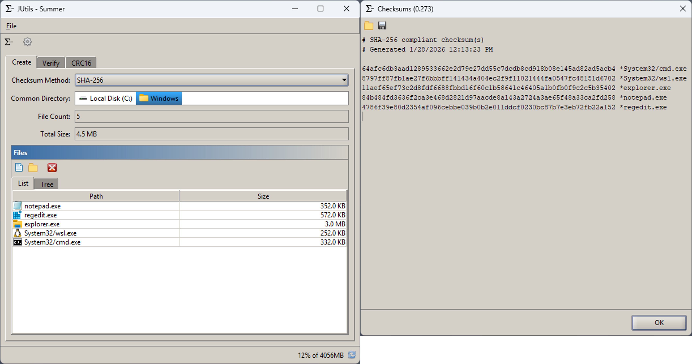
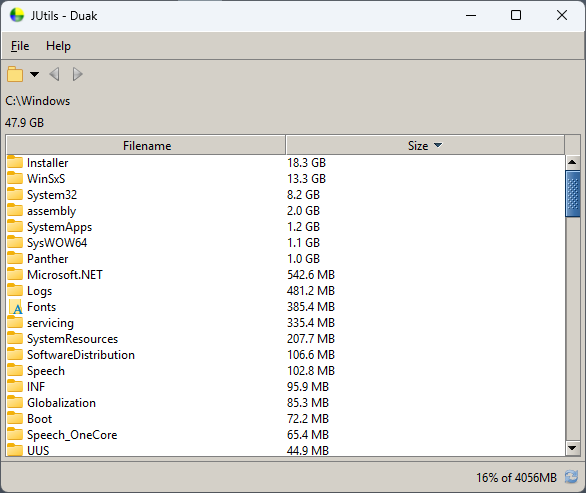

# JUtils

Contains common utility classes for java.

[To Do](./todo.md)

## License

JUtils is licensed under the MIT License. You are permitted to use, copy, modify, distribute, sublicense and sell copies of the software.

JUtils comes with no warranty of correctness though it totally is.

## Sub Projects

| Name | Description |
| --- | --- |
| [Apps](./docs/apps.md) | Provides a launcher that bundles all applications, tools, and displays into a single application. |
| [Core](./docs/core.md) | A library of the core JUtils classes. |
| [Demo](./docs/demo.md) | Demonstrates the look and operation of JUtils components. |
| [Duak](./docs/duak.md) | Disk Usage Analyzer Kit |
| [Explorer](./docs/explorer.md) | A file explorer. |
| [FileSpy](./docs/filespy.md) | Search for, and within, files. |
| [HexEdit](./docs/hexedit.md) | A hex view who dreams of being an editor. |
| [CUtils](./docs/cutils.md) | A set of C++ classes; some of which, has access through JNI. |
| [Insomnia](./docs/insomnia.md) | Measures when the user is awake.  |
| [Iris](./iris.md) | Displays frames of raw camera data for inspection and analysis. |
| [Kairosion](./kairosion) | Converts times to several formats. |
| [Math](./docs/math.md) | Provides a library of math, matrix operations, and coordinate transformations. |
| [Mines](./docs/mines.md) | Java version of minesweeper. |
| [Multicon](./docs/multicon.md) | Multiple network connection manager. |
| [Platform](./docs/platform.md) | Provides an library for platform specific functions including Serial UART. |
| [Plot](./docs/plot.md) | Creates scatter plots. |
| [Summer](./docs/summer.md) | Generates/validates checksums. |
| [Telemetry](./docs/telemetry.md) | Displays telemetry files and parameters. |

## Supporting Projects

| Name | Description |
| --- | --- |
| Libs | Contains the JGoodies and XStream libraries. Both are planned to be phased out and replaced with support withing JUtils. |
| Tests | Unit and graphical tests for all sub-projects. |

## Screenshots

- [Apps Window](#apps-window)
- [Hexedit Window](#hexedit-window)
- [Hexulator Window](#hexulator-window)
- [Multicon Window](#multicon-window)
- [Kairosion Window](#kairosion-window)

### Apps Window

[Screenshots](#screenshots)

### Hexedit Window

[Screenshots](#screenshots)

### Hexulator Window

[Screenshots](#screenshots)

### Multicon Window

[Screenshots](#screenshots)

### Kairosion Window

[Screenshots](#screenshots)

### Serial Console Window

[Screenshots](#screenshots)

### Filespy Window

[Screenshots](#screenshots)

### JChart Window

[Screenshots](#screenshots)

### Summer Window

[Screenshots](#screenshots)

### Duak Window

[Screenshots](#screenshots)
