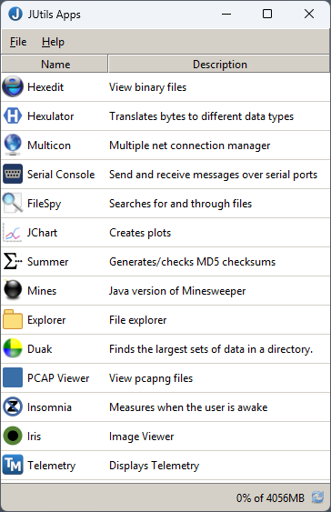
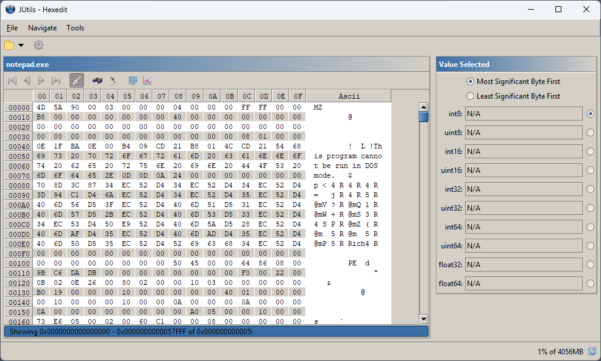

# JUtils

Contains common utility classes for java.

[To Do](./todo.md)

## License

JUtils is licensed under the MIT License. You are permitted to use, copy, modify, distribute, sublicense and sell copies of the software.

JUtils comes with no warranty of correctness though it totally is.

## Main Projects

| Name | Description |
| --- | --- |
| [Apps](./docs/apps_readme.md) | Provides a launcher that bundles all applications, tools, and displays into a single application.
| [Core](./docs/core_readme.md) | A library of the core JUtils classes.
| Demo |  |
| Duak | Disk Usage Analyser Kit |
| Explorer |  |
| FileSpy |  |
| HexEdit |  |
| [Jerial](./jerial/jerial.md) |  |
| Insomnia |  |
| Math |  |
| Mines |  |
| Multicon |  |
| Plot |  |
| Serial |  |
| Summer |  |

## Supporting Projects

| Name | Description |
| --- | --- |
| Libs |  |
| Tests |  |

## Screenshots

